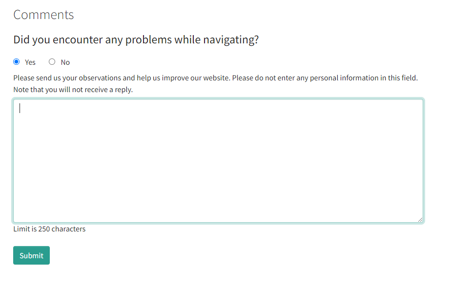
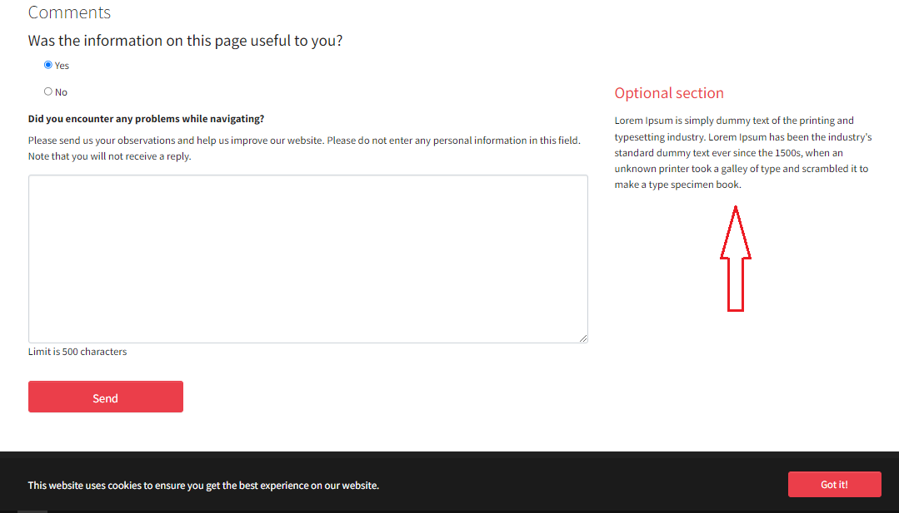

Qc Comments
==============================================================
*La [version française](#documentation-qc-references) de la documentation suit le texte anglais*

## About
This extension can be used for managing comments section for frontend pages.

It comes with two important features :
## Frontend plugin
A plugin that allows an administrator to add a comments section as a form, where the frontend users can send their comments and opinions for each page.
The comments component can be enabled or disabled using four different ways :
- Comments for the selected page and all its sub-pages.
- Comments only for the selected page.
- No comments component for the selected page.
- No comments component for the selected page and its sub-pages.

Note : The option can be changed using the input that cames with the extension named "Select comments section display mode" in the 'Pages module' configuration in the 'Extended' tab.
If the option isn't specified in a page by the administrator, the option will be inherited from the parent page.

Note : To add the comments form component to your frontend pages, you will have to add the current component to your TypoScript configuration:
    
    lib.commentForm = COA
    lib.commentForm {
        10 = USER
        10 {
            userFunc = TYPO3\CMS\Extbase\Core\Bootstrap->run
            extensionName = QcComments
            pluginName = commentsForm
        }
    }

In the Fluid pages:

    <f:cObject typoscriptObjectPath="lib.commentForm" />

### Form Controls
#### Recaptcha
By default, the recaptcha control is disabled, you can enable it by using the Typoscript configuration :  

    plugin.commentsForm {
        settings {
            recaptcha {
                // enabled = 1, disabled = 0
                enabled = 1
                // Your recpatcha site key
                sitekey = 
            }
        }
    }

#### Form validation
You can also control the size of the submitted comments, by controlling the minimum and the maximum number of characters that a comment can contain.

    plugin.commentsForm {
        settings {
            comments {
                maxCharacters = 500
                minCharacters = 2
            }
        }
    }

#### Anonymize sensitive information
If you hope to hide the sensitive data from the submitted comments like email adresses or phone numbers, you can apply any patten you want by using the following configuration :
    
    plugin.commentsForm {
        settings {
            comments {
                 anonymizeComment {
                    enabled = 1
                    pattern = /(?:[a-zA-Z0-9._%+-]+@[a-zA-Z0-9.-]+\.[a-zA-Z]{2,})|\b\d{3}[-.]?\d{3}[-.]?\d{4}\b/
                }
            }
        }
    }

#### Spam shield
The extension cames also with a spam shield with three protections :

* Honeypot check

* Value blacklist check

* Link check

You can configure this protection with the typoscript configuration that cames with the extension, in the setup.typoscript file.

#### Screenshot of the comments form in a front end page

## Backend module
This module contains two different tabs:

#### Statistics tab

This tab is used to give the administrator an idea of how much a selected page is useful for frontend users by using a table
with analytics data.
#### Screenshot of the statistics tab

#### Comments tab
By using this tab, the administrator can list the comments records that are sent for each selected page by the users.

#### Screenshot of the comments tab

The extension also came with an export function that allow user to export comment or statistiques based on the filter options.

The rendering result can be controlled by the following Tsconfig configuration:

    mod{
        qcComments {
            comments {
                // Order by comment date
                orderType = DESC
                // Max records that will be shown in the comments table
                maxRecords = 100
                // Number of subpages that will be parsed
                numberOfSubPages = 50
                // Show comments for hidden pages
                showCommentsForHiddenPages = 1
    
            }
            statistics {
                // Max records that will be showed in the statistics table
                maxRecords = 30
                // Show statistics for hidden pages
                showStatisticsForHiddenPages = 1
            }
    
            csvExport {
                filename {
                    // This date will added to the exported file name
                    dateFormat = YmdHi
                }
                // Csv parameters
                separator = ;
                enclosure = "
                escape = \
            }
        }
    }

[Version française]
# Documentation Qc Comments

## À propos
L’extension propose une solution qui permet de gérer la partie commentaires sur les pages frontend, elle offre un plugin frontend sous forme d’un formulaire que l’utilisateur puisse l’utiliser pour envoyer ses commentaires, ainsi qu’un module Backend qui permet l’administrateur d’afficher et analyser les différents commentaires envoyés pour chaque page.

## Frontend plugin
Ce plugin permet l'administrateur d'ajouter le composant de commentaires sous forme d'un formulaire frontend, où les utilisateurs peuvent envoyer leurs commentaires et avis.
L'affichage de formulaire de commentaires dans le frontend peut être controller 
par quatre différents choix :
- Afficher pour cette page et ses sous-pages
- Afficher pour cette page seulement
- Masquer pour cette page et ses sous-pages
- Masquer pour cette page seulement

NB : Le choix de mode d'affichage peut être sélectionné à partir d'un champ nommé "Sélectionner le mode d'affichage de la section commentaires" dans le module "Page".
Si le choix d'affichage n'est pas choisie manuellement par l'administrateur le choix de la page parent sera hérité.

NB : Pour intégrer le composant dans vos pages front end, il faut ajouter l'élément suivant dans votre configuration TypoScript :

    lib.commentForm = COA
    lib.commentForm {
        10 = USER
        10 {
            userFunc = TYPO3\CMS\Extbase\Core\Bootstrap->run
            extensionName = QcComments
            pluginName = commentsForm
        }
    }

Dans les pages Fluid pages fluid :

    <f:cObject typoscriptObjectPath="lib.commentForm" />

### Les contrôles de formulaire
#### Recaptcha
Par défaut, le contrôle recaptcha est désactivé, vous pouvez l'activer et le configurer en utilisant la configuration suivante : 
       
     plugin.commentsForm {
            settings {
                recaptcha {
                    // enabled = 1, disabled = 0
                    enabled = 1
                    // Your recpatcha site key
                    sitekey = 
                }
            }
        }

#### Partie validation de formulaire
L'extension vous permet aussi de controller la taille des commentaires envoyés par les utilisateurs, en spécifiant le nombre minimum et maximum des caractères autorisé à chaque commentaire envoyé :  

    plugin.commentsForm {
        settings {
            comments {
                maxCharacters = 500
                minCharacters = 2
            }
        }
    }

#### Anonymiser les informations sensibles
Si vous souhaitez cacher les informations qui sont considéré sensibles pour vous dans les commentaires envoyés par les utilisateurs, vous pouvez appliquer un pattern qui permet de filtrer le contenu des commentaires en cachant les données sensibles :

    plugin.commentsForm {
        settings {
            comments {
                 anonymizeComment {
                    enabled = 1
                    pattern = /(?:[a-zA-Z0-9._%+-]+@[a-zA-Z0-9.-]+\.[a-zA-Z]{2,})|\b\d{3}[-.]?\d{3}[-.]?\d{4}\b/
                }
            }
        }
    }

#### Le contrôle de Spam
L'extension vous fournit un contrôle de spam avec trois différentes méthodes : 

* Honeypot check

* Vérification de la liste noire des valeurs

* Vérification du lien

Vous pouvez configurer ces contrôles directement dans le fichier setup.typoscript de l'extension.

### Additional content element
L'affichage de plugin qc_comments porte deux sections séparées, une pour afficher le formulaire de commentaire,
la deuxième est optionnelle, vous pouvez choisir un tt_content pour l'affiché à coté de commentaire, la capture d'écran montre 
un exemple d'affichage de cette section : 

Pour faire référencer à un tt_content (text, titre, etc.), vous pouvez ajouter la configuration Typoscript suivante :

    lib.qcCommentsAdditionalContent = COA
    lib.qcCommentsAdditionalContent {
        20 = CONTENT
        20 {
            table = tt_content
            select {
                max = 1
                # L'UID de la page ou de repertoir parent qui pourte le tt_content à afficher
                pidInList = 12
                # L'UID de tt_content à afficher
                where = (uid = 8)
            }
        }
    }

La configuration Typoscript ci-dessus montre un exemple d'integration d'un elemente tt_content pour l'afficher dans la partie optionnelle de pluguin.

Note : Il est important de garder le nom de définition 'lib.qcCommentsAdditionalContent'.

## Backend module
Ce module vient avec deux tabulations :

#### Statistiques
Cette tabulation permet l'administrateur d'avoir une idée sur l'utilité de la page pour les utilisateurs frontend, en se basant sur les commentaires positifs et les commentaires
négatifs.

#### Commentaires
En utilisant cette tabulation, l'administrateur peut lister les commentaires envoyés par page.

NB : Toutes les données listées dans les deux tabulations peuvent être filtré or exporter sous format csv.
NB : L'extension offre aussi une fonctionnalité qui permet d'exporter les commentaires ou les résultats des statistiques en se basant sur les options de filtres sélectionnées.

L'affichage dans les deux tabulations peut être controller en utilisant la configuration Tsconfig suivante :

     mod{
        qcComments {
            comments {
                // Type de tri (tri sur le champ date)
                orderType = DESC
                // Nombre maximum des commentaires affichés
                maxRecords = 100
                // Nombre maximum des sous-pages considérées 
                numberOfSubPages = 50
                // Afficher la liste des commentaires pour les pages cachées
                showCommentsForHiddenPages = 1
    
            }
            statistics {
                // Nombre maximum des statistiques affichées
                maxRecords = 30
                // Afficher les statisques pour les pages cachées
                showStatisticsForHiddenPages = 1
            }
    
            csvExport {
                filename {
                    // La date sera ajoutée au nom de fichier
                    dateFormat = YmdHi
                }
                // Les paramétres de CSV
                separator = ;
                enclosure = "
                escape = \
            }
        }
    }
