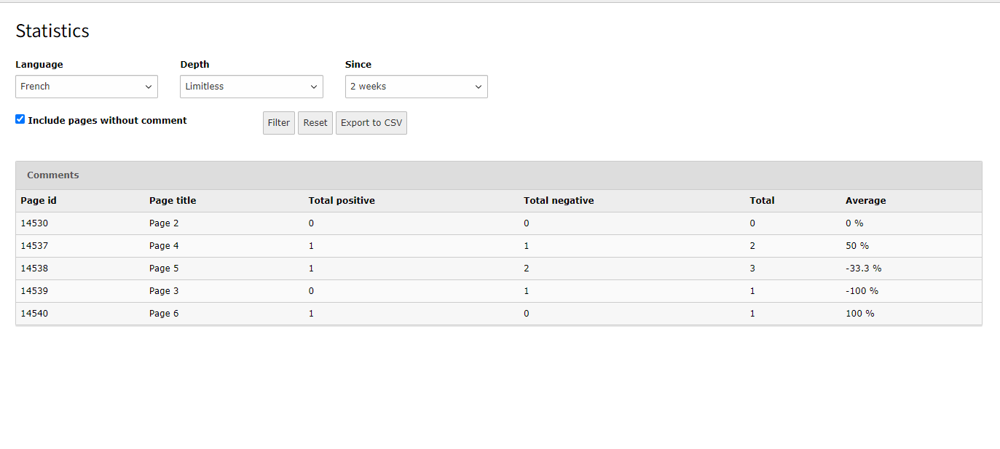
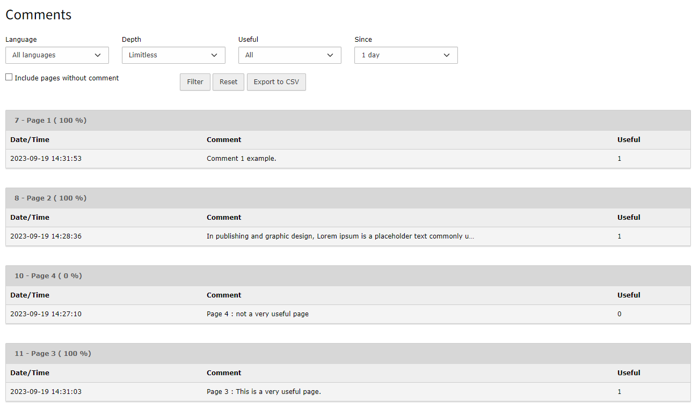

Qc Comments
==============================================================
*La [version française](#documentation-qc-references) de la documentation suit le texte anglais*

## About
This extension can be used for managing comments section for frontend pages.

It comes with two important features :
### Frontend plugin
A plugin that allow an administrator to add comments section as a form, where the frontend users can send their comments and opinions for each page.
the comments component can be enabled or disabled using four different ways :
- Comments for the selected page and all its sub-pages
- Comments only for the selected page
- No comments component for the selected page
- No comments component for the selected page and its sub-pages.

Note : The option can be changed using the input that cames with the extension named "Select comments section display mode" in the 'Pages module' configuration.
If the option isn't override in a page by administrator, the option will be inheritance from the parent page.

### Backend module
This module contains two different tabs :

#### Statistics tab

This tab is used to give the administrator an idea of how much a selected page is useful for frontend users by using a table
with analytics data.
#### Screenshot of the statistics tab

#### Comments tab
By using this tab, the administrator can list the comments records that are sent for each selected page by the users.

#### Screenshot of the comments tab

Note : All the rendering data for each tab can be filtered and exported as csv file.
The rendering result can be controlled by Typoscript configuration :

    settings {
        comments {
            // Maximum number of records that will be display in comments tab
            maxRecords = 100
            
            // Number of subpages used for rendering comments
            numberOfSubPages = 50
        }
        statistics {
            // Maximum number of records that will be display in statistics tab
            maxRecords = 30
        }
        
        // Specify the export date format
        csvExport {
            filename {
                dateFormat = YmdHi
            }
        }
    }

[Version française]
# Documentation Qc Comments

## À propos
Cette extension propose une solution pour gérer la partie commentaires pour les pages frontend, pour cela il vient avec deux fonctionnalités importantes :

### Frontend plugin
Cette plugin permet l'administrateur d'ajouter le composant de commentaires sous forme d'un formulaire frontend, où les utilisateur peuvent envoyer leurs commentaires et avis.
L'affichage de formulaire de commentaires dans le frontend peut être controller 
par quatre différents choix:
- Afficher pour cette page et ses sous-pages
- Afficher pour cette page seulement
- Masquer pour cette page et ses sous-pages
- Masquer pour cette page seulement

NB : Le choix de mode d'affichage peut être sélectionner à partir d'un champ nommé "Sélectionner le mode d'affichage de la section commentaires" dans le module "Page".
Si le choix d'affichage n'est pas choisie manuellement par l'administrateur le choix de la page parent sera hérité.

### Backend module
Ce module vient avec deux tabulations :

#### Statistiques
Cette tabulation permet l'administrateur d'avoir une idée sur l'utilité de la page pour les utilisateurs frontend, en se basant sur les commentaires positifs et les commentaires
négatifs.

#### Commentaires
En utilisant cette tabulation, l'administrateur peut lister les commentaires envoyés par page.

NB : Tous les données listés dans les deux tabulations peuvent être filtré or exporter sous format csv.
L'affichage dans deux tabulations peut être controller en utilisant la configuration typiscript ce dessous :

    settings {
        comments {
            // Nombre maximum des commentaires affiché dans la tabulation des commentaires
            maxRecords = 100
            
            // Nombre maximum des sous pages utilisées pour récupérer les commentaires
            numberOfSubPages = 50
        }
        statistics {
            // Nombre maximum des résultat calculés dans la tabulation des statistiques 
            maxRecords = 30
        }
        
        // Format de date utilisée pour l'export csv
        csvExport {
            filename {
                dateFormat = YmdHi
            }
        }
    }
