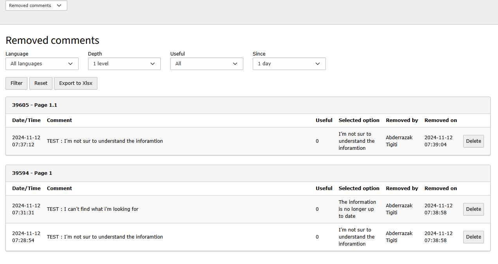

Qc Comments
==============================================================
*La [version française](#documentation-qc-comments) de la documentation suit le texte anglais*

## About
This extension can be used for managing comments section for frontend pages.

It comes with two important features :
## Frontend plugin
A plugin that allows an administrator to add a comments section as a form, where the frontend users can send their comments and opinions for each page.
The comments component can be enabled or disabled using four different ways :
- Comments for the selected page and all its sub-pages.
- Comments only for the selected page.
- No comments component for the selected page.
- No comments component for the selected page and its sub-pages.

Note : The option can be changed using the input that cames with the extension named "Select comments section display mode" in the 'Pages module' configuration in the 'Extended' tab.
If the option isn't specified in a page by the administrator, the option will be inherited from the parent page.

Note : To add the comments form component to your frontend pages, you will have to add the current component to your TypoScript configuration:

    lib.commentForm = COA
    lib.commentForm {
        10 = USER
        10 {
            userFunc = TYPO3\CMS\Extbase\Core\Bootstrap->run
            extensionName = QcComments
            pluginName = commentsForm
        }
    }

In the Fluid pages:

    <f:cObject typoscriptObjectPath="lib.commentForm" />

### Form Controls
#### reCAPTCHA
Then extension supports two modes of reCAPTCHA, Invisible reCAPTCHA and the visible reRECAPTCHA, by default the reCAPTCHA control is disabled, you can enable it by using the Typoscript configuration :

    plugin.tx_qccomments {
        settings {
            recaptcha {
                # '1' for enable the reCAPTCHA and '0' to disable it
                enabled = 0
                # visible or invisible
                recaptchaMode =
                # your reCAPTCHA sitekey
                sitekey =
                # your reCaptcha secret key
                secret =
            }
        }
    }

#### Spam shield
The extension cames also with a spam shield with three protections :

* Honeypot check

* Value blacklist check

* Link check

You can configure this protection with the Typoscript configuration that cames with the extension, in the "setup.typoscript" file.

## FrontEnd section

The frontend comments plugin supports three different types of comments:

* A Positive Comment
By clicking the “Yes” button, the form is submitted, and a message will be displayed indicating that the form has been sent. You can then add a comment explaining how this page was useful.
* A Negative Comment
If the user clicks “No,” the form displays a text field and options to explain why the page was not useful.
* Reporting a Technical Problem
The user will also have the option to report a technical issue by clicking the “Report a Problem” link. In this case, the form displays a text field and options to select the type of problem encountered.

Note: The options displayed in the form sections should have a unique code and can be configured in TypoScript:

    settings {
        options {
        positive_section {
        reasons {
            1 {
                code = POSITIVE_CODE1
                fr {
                    short_label = Contenu clair et complet
                    long_label = Le contenu est clair et complet
                }
                en {
                    short_label = Content up to date
                    long_label = Content is clear and complete
                }
        }
            2 {
              code = POSITIVE_CODE2
              fr {
                short_label = Renseignements à jour
                long_label =  Les renseignements sont à jour
              }
              en {
                short_label = Information is up to date
                long_label = Information is up to date
              }
            }
      }
      maxCharacters = 200
      #minCharacters = 0
      anonymizeComment {
        enabled = 1
        pattern = /(?:[a-zA-Z0-9._%+-]+@[a-zA-Z0-9.-]+\.[a-zA-Z]{2,})|\b\d{3}[-.]?\d{3}[-.]?\d{4}\b/
      }
    }
    negative_section {
      reasons {
        1 {
          code = NEGATIVE_CODE1
          fr {
            short_label = Information introuvable
            long_label = Je ne trouve pas ce que je cherche
          }
          en {
            short_label = Information not foundable
            long_label = I couldn’t find what I was looking for
          }

        }
        2 {
          code = NEGATIVE_CODE2
          fr {
            short_label = Information confue
            long_label = L’information présentée porte à confusion
          }
          en {
            short_label = Confusing information
            long_label = The information is unclear
          }

        }
      }
      maxCharacters = 200
      minCharacters = 0
      anonymizeComment {
        enabled = 1
        pattern = /(?:[a-zA-Z0-9._%+-]+@[a-zA-Z0-9.-]+\.[a-zA-Z]{2,})|\b\d{3}[-.]?\d{3}[-.]?\d{4}\b/
      }
    }
    reportProblem_section {
      reasons {
        1 {
          code = PROBLEM_CODE1
          fr {
            short_label = Problème d’affichage
            long_label = Il y a un problème avec l’affichage de la page
          }
          en {
            short_label = Display problem
            long_label = There is a problem with the page display
          }

        }
        2 {
          code = PROBLEM_CODE2
          fr {
            short_label = Lien brisé
            long_label = Un lien ne fonctionne pas ou n’est plus à jour
          }
          en {
            short_label = Broken link
            long_label = There is a broken or outdated link
          }

        }
      }
      maxCharacters = 500
      minCharacters = 0
      anonymizeComment {
        enabled = 1
        pattern = /(?:[a-zA-Z0-9._%+-]+@[a-zA-Z0-9.-]+\.[a-zA-Z]{2,})|\b\d{3}[-.]?\d{3}[-.]?\d{4}\b/
      }
    }

    }

Notes :
* the option maxCharacters and minCharacters are used to control the allowed number of character in a comment for each section.
* For each comment section, If you hope to hide the sensitive data from the submitted comments like email adresses or phone numbers, you can apply any patten you want by using the following configuration :

    anonymizeComment {
        enabled = 1
        pattern = /(?:[a-zA-Z0-9._%+-]+@[a-zA-Z0-9.-]+\.[a-zA-Z]{2,})|\b\d{3}[-.]?\d{3}[-.]?\d{4}\b/
    }

## Backend module

This module comes with four tabs, with the ability to export the displayed data to an XLS file.

Note: The TSconfig configuration used for the Backend is a **User/Group TSconfig** configuration.

### Satisfaction statistics
This tab allows the administrator to get an idea of the page’s usefulness for frontend users, based on positive and negative comments. This module is configured using the following TSconfig:

    mod.qcComments.comments {
        // Maximum number of records displayed
        maxRecords = 30
        // Enable/Disable display of records for hidden pages
        showRecordsForHiddenPages = 1
    }

### Comments
In this module, the user can list the comments submitted for the selected page, and will also have the option to remove or delete a comment. This module is configured using the following TSconfig:

    mod.qcComments.comments {
        // Sort type (by date)
        orderType = DESC
        // Maximum number of records displayed
        maxRecords = 100
        // Maximum number of child pages considered
        numberOfSubPages = 50
        // Enable/Disable display of records for hidden pages
        showRecordsForHiddenPages = 1
        // Enable/Disable the button to Remove a comment
        enableRemoveButton = 1
        // Enable/Disable the button to Delete a comment
        enableDeleteButton = 1
    }

Note : if a comment is removed, that means that it will be shown in the "Removed comments" module.

### Removed Comments
This module displays the list of comments that have been removed by the user by clicking the “Remove” button in the “Comments” module. It is configured using the following TSconfig:

    mod.qcComments.hiddenComments {
        // Sort type (by date)
        orderType = DESC
        // Maximum number of records displayed
        maxRecords = 100
        // Maximum number of child pages considered
        numberOfSubPages = 50
        // Enable/Disable display of records for hidden pages
        showRecordsForHiddenPages = 1
        // Enable/Disable the button to Delete a comment
        enableDeleteButton = 1
    }

### Technical Problems
This module seres to display the list of submitted technical problems, and the user will have the option to address a problem by clicking the “Fix” button. TSconfig configuration:

    mod.qcComments.technicalProblems {
        // Sort type (by date)
        orderType = DESC
        // Maximum number of records displayed
        maxRecords = 100
        // Maximum number of child pages considered
        numberOfSubPages = 50
        // Enable/Disable display of records for hidden pages
        showRecordsForHiddenPages = 1
        // Enable/Disable the "Fix" button
        enableFixButton = 1
    }

[Version française]
# Documentation Qc Comments

## À propos
Cette extension propose une solution pour gérer la partie commentaires pour les pages frontend :

## Frontend plugin
Ce plugin permet l'administrateur d'ajouter le composant de commentaires sous forme d'un formulaire frontend, où les utilisateurs peuvent envoyer leurs commentaires et avis.
L'affichage de formulaire de commentaires dans le frontend peut être controller
par quatre différents choix :
- Afficher pour cette page et ses sous-pages
- Afficher pour cette page seulement
- Masquer pour cette page et ses sous-pages
- Masquer pour cette page seulement

NB : Le choix de mode d'affichage peut être sélectionné à partir d'un champ nommé "Sélectionner le mode d'affichage de la section commentaires" dans le module "Page".
Si le choix d'affichage n'est pas choisie manuellement par l'administrateur le choix de la page parent sera hérité.

NB : Pour intégrer le composant dans vos pages front end, il faut ajouter l'élément suivant dans votre configuration TypoScript :

    lib.commentForm = COA
    lib.commentForm {
        10 = USER
        10 {
            userFunc = TYPO3\CMS\Extbase\Core\Bootstrap->run
            extensionName = QcComments
            pluginName = commentsForm
        }
    }

Dans les pages Fluid :

    <f:cObject typoscriptObjectPath="lib.commentForm" />

### Les contrôles de formulaire
#### Recaptcha
L'extension supporte deux modes de reCAPTCHA, Invisible et le reCAPTCHA visible, par défaut le control reCAPTCHA est désactivé, vous pouvez l'activer et le configurer en utilisant la configuration suivante :

    plugin.tx_qccomments {
        settings {
            recaptcha {
                # '1' pour activer le reCaptcha, '0' pour le desactiver
                enabled = 0
                # visible ou invisible
                recaptchaMode =
                # sitekey de reCAPTCHA
                sitekey =
                # secret de reCAPTCHA
                secret =
            }
        }
    }

#### Le control de Spam
L'extension vous fournit un contrôle de spam avec trois différentes méthodes :

* Honeypot check

* Vérification de la liste noire des valeurs

* Vérification du lien

Vous pouvez configurer ces contrôles directement dans le fichier setup.typoscript de l'extension.

## Fonctionnement FE
Le plugin des commentaires en FE porte 3 différent type de commentaires :
* Un commentaire positif
  En cliquant sur le bouton « Oui », le formulaire s’envoi, un message par la suite sera affiché qui indique que le formulaire a été envoyé.
  et on peut ajouter ensuite un commentaire qui explique comment cette page était utile.

* Un commentaire négatif
  Si l'internaute a cliqué sur « Non », le formulaire affiche un champ text et des options pour expliquer pourquoi la page n'était pas utile.
* Reporter un problème techniques
  L'internaute aura aussi la possibilité de reporter un problème technique, en cliquant sur le lien « Signaler un problème », dans ce cas le formulaire affiche
  un champ text et des options pour sélectionner le type de problème rencontré.

Note : les options affichées dans le formulaire pour la section "Commentaires négatifs" et "Signaler un problème" peuvent être configurés
en Typoscript :

    settings {
        options {
        positive_section {
        reasons {
            1 {
                code = POSITIVE_CODE1
                fr {
                    short_label = Contenu clair et complet
                    long_label = Le contenu est clair et complet
                }
                en {
                    short_label = Content up to date
                    long_label = Content is clear and complete
                }
        }
            2 {
              code = POSITIVE_CODE2
              fr {
                short_label = Renseignements à jour
                long_label =  Les renseignements sont à jour
              }
              en {
                short_label = Information is up to date
                long_label = Information is up to date
              }
            }
      }
      maxCharacters = 200
      #minCharacters = 0
      anonymizeComment {
        enabled = 1
        pattern = /(?:[a-zA-Z0-9._%+-]+@[a-zA-Z0-9.-]+\.[a-zA-Z]{2,})|\b\d{3}[-.]?\d{3}[-.]?\d{4}\b/
      }
    }
    negative_section {
      reasons {
        1 {
          code = NEGATIVE_CODE1
          fr {
            short_label = Information introuvable
            long_label = Je ne trouve pas ce que je cherche
          }
          en {
            short_label = Information not foundable
            long_label = I couldn’t find what I was looking for
          }

        }
        2 {
          code = NEGATIVE_CODE2
          fr {
            short_label = Information confue
            long_label = L’information présentée porte à confusion
          }
          en {
            short_label = Confusing information
            long_label = The information is unclear
          }

        }
      }
      maxCharacters = 200
      minCharacters = 0
      anonymizeComment {
        enabled = 1
        pattern = /(?:[a-zA-Z0-9._%+-]+@[a-zA-Z0-9.-]+\.[a-zA-Z]{2,})|\b\d{3}[-.]?\d{3}[-.]?\d{4}\b/
      }
    }
    reportProblem_section {
      reasons {
        1 {
          code = PROBLEM_CODE1
          fr {
            short_label = Problème d’affichage
            long_label = Il y a un problème avec l’affichage de la page
          }
          en {
            short_label = Display problem
            long_label = There is a problem with the page display
          }

        }
        2 {
          code = PROBLEM_CODE2
          fr {
            short_label = Lien brisé
            long_label = Un lien ne fonctionne pas ou n’est plus à jour
          }
          en {
            short_label = Broken link
            long_label = There is a broken or outdated link
          }

        }
      }
      maxCharacters = 500
      minCharacters = 0
      anonymizeComment {
        enabled = 1
        pattern = /(?:[a-zA-Z0-9._%+-]+@[a-zA-Z0-9.-]+\.[a-zA-Z]{2,})|\b\d{3}[-.]?\d{3}[-.]?\d{4}\b/
      }
    }

    }

Notes :
* l'option maxCharacters et minCharacters, sont utilisées pour configurer le nombre maximum de caractères autorisé dans un commentaire.
* Pour chaque section, si vous souhaitez cacher les informations qui sont considérées sensibles pour vous dans les commentaires envoyés par les utilisateurs, vous pouvez appliquer un pattern qui permet de filtrer le contenu des commentaires en cachant les données sensibles :

    anonymizeComment {
        enabled = 1
        pattern = /(?:[a-zA-Z0-9._%+-]+@[a-zA-Z0-9.-]+\.[a-zA-Z]{2,})|\b\d{3}[-.]?\d{3}[-.]?\d{4}\b/
    }

## Backend module
Ce module vient avec quatre tabulations, avec la possibilité d'exporter les données affichées en fichier XLS.

Note : La configuration TSconfig utilisée pour le Backend, est une configuration **TSconfig d'utilisateur ou groupe**.

#### Statistiques de satisfaction
Cette tabulation permet l'administrateur d'avoir une idée sur l'utilité de la page pour les utilisateurs frontend, en se basant sur les commentaires positifs et les commentaires
négatifs.
Ce module est configuré en utilisant la configuration TSconfig suivante :

        mod.qcComments.comments {
            // Nombre maximum des enregistrements affichés
            maxRecords = 30
            // Activer/Descativer l'affichage des enregistrements pour les pages cachées
            showRecordsForHiddenPages = 1
        }

#### Commentaires
Dans ce module, l'utilisateur peut lister les commentaires envoyés pour la page sélectionnée, il aura aussi la possibilité de retirer ou supprimer un commentaire.
Ce module est configuré en utilisant la configuration TSconfig suivante :

        mod.qcComments.comments {
            // Type de tri (par date)
            orderType = DESC
            // Nombre maximum des enregistrements affichés
            maxRecords = 100
            // Nombre maximum des pages filles considérées
            numberOfSubPages = 50
            // Activer/Descativer l'affichage des enregistrements pour les pages cachées
            showRecordsForHiddenPages = 1
            // Activer/Descativer le boutton pour Retirer un commentaire
            enableRemoveButton = 1
            // Activer/Descativer le bouton pour Supprimer un commentaire
            enableDeleteButton = 1
        }

Note : si un commentaire est retiré, cela signifie qu'il sera affiché dans le module "Commentaires retirés".

#### Commentaires retirés
Ce module affiche la liste des commentaires qui ont été retirés par l'utilisateur en cliquant sur le bouton "Retirer" dans le module des "Commentaires". Il est configuré en utilisant
la configuration TSconfig suivante :

         mod.qcComments.hiddenComments {
            // Type de tri (par date)
            orderType = DESC
            // Nombre maximum des enregistrements affichés
            maxRecords = 100
            // Nombre maximum des pages filles considérées
            numberOfSubPages = 50
            // Activer/Descativer l'affichage des enregistrements pour les pages cachées
            showRecordsForHiddenPages = 1
            // Activer/Descativer le bouton pour Supprimer un commentaire
            enableDeleteButton = 1
         }

#### Problèmes téchniques
Ce module sert à afficher la liste des problèmes techniques envoyés, l'utilisateur aura la possibilité de traiter un problème en cliquant sur le bouton "Traiter".
Configuration TSconfig :

          mod.qcComments.technicalProblems {
            // Type de tri (par date)
            orderType = DESC
            // Nombre maximum des enregistrements affichés
            maxRecords = 100
            // Nombre maximum des pages filles considérées
            numberOfSubPages = 50
            // Activer/Descativer l'affichage des enregistrements pour les pages cachées
            showRecordsForHiddenPages = 1
            // Activer/Descativer le boutton "Traiter"
            enableFixButton = 1
          }
